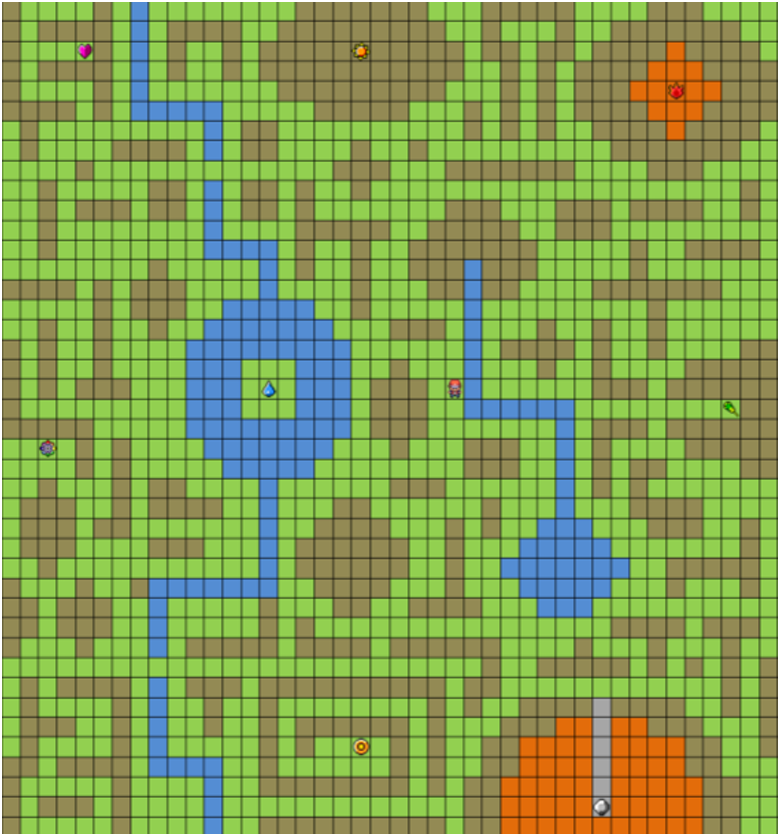
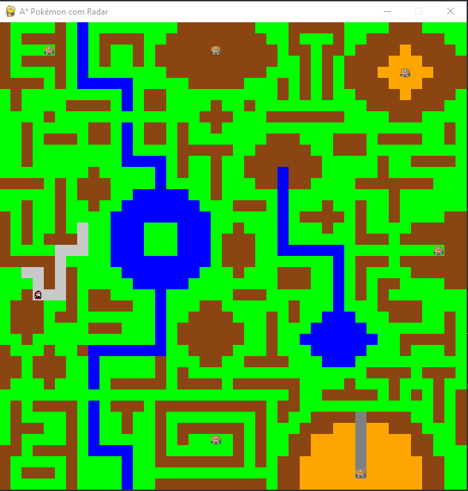
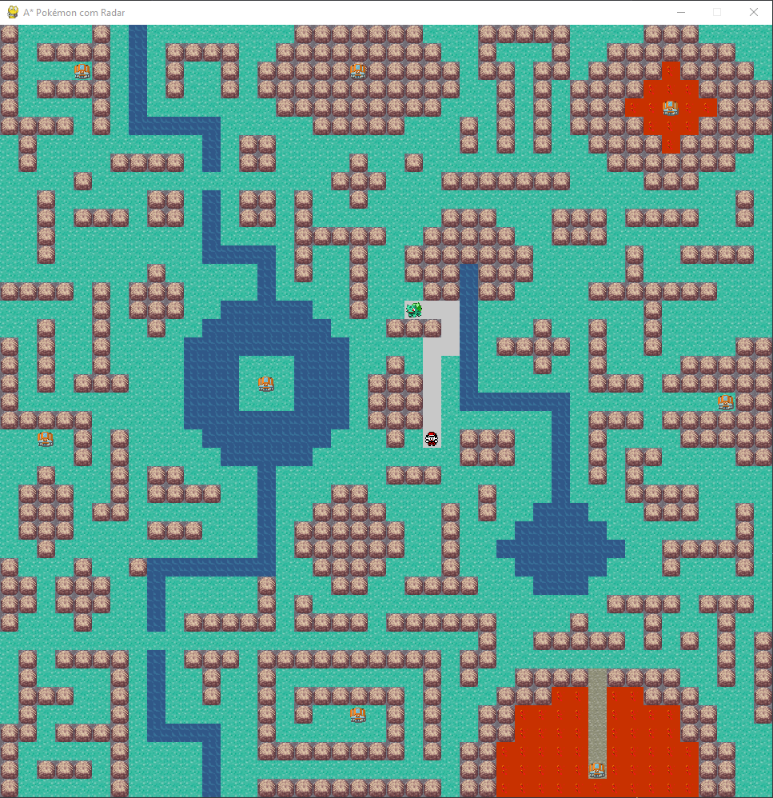
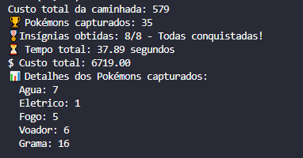

# A* Pokémon com Radar

Este projeto simula um agente que explora um mapa utilizando o algoritmo de busca A* para capturar Pokémons e conquistar 8 insígnias de ginásios, tudo isso com visualização gráfica feita com **pygame**.

## 🎯 Objetivo

O agente percorre um mapa 42x42, enfrentando diferentes terrenos com custos variados. Ele:

- Prioriza conquistar **insígnias** de ginásios.
- Captura **Pokémons** visíveis próximos.
- Se beneficia de **bônus de terreno** ao capturar Pokémons de tipos específicos.
- Utiliza sprites personalizados e uma lava animada no estilo retrô.

## 🚀 Como executar

1. Clone o repositório:

```
git clone https://github.com/Luskinha04/pokemon-heuristicaAStar
cd pokemon-heuristicaAStar
```
2. Instale o pygame:

```
pip install pygame
```

3. Execute o programa:

```
python pokepython-visualzao.py
```

> Obs: Certifique-se de ter as imagens dos sprites (.png) na mesma pasta do código.

## 📷 Screenshots

### Mapa de Referência para a Atividade:


### Execução do Programa:


### 🔥 Novo Mapa com Gráficos Aprimorados:


### Resultados Finais no Terminal:


## 🧠 Lógica do Projeto

- O mapa possui terrenos com diferentes custos (`Grama`, `Água`, `Montanha`, `Caverna`, `Vulcão`).
- Cada tipo de Pokémon reduz o custo de movimentação em determinados terrenos.
- O radar da Pokédex revela Pokémons num raio de 4 blocos.
- O algoritmo A* busca sempre o caminho de menor custo até o próximo objetivo:
  - Ginásio mais próximo (prioridade).
  - Pokémon mais próximo, se não houver ginásio próximo.

## 🎮 Controles

- O agente se move automaticamente.
- Feche a janela do pygame para encerrar manualmente, ou aguarde o agente capturar 8 insígnias.

## 📁 Estrutura de Arquivos
```
📦pokemon-heuristicaAStar/
 ┣ 📂sprites/
 ┃ ┣ agua.png
 ┃ ┣ grama.png
 ┃ ┣ montanha.png
 ┃ ┣ caverna.png
 ┃ ┗ 📂lava/
 ┃   ┣ lava_00.png
 ┃   ┣ ...
 ┃   ┗ lava_26.png
 ┣ 📂screenshots/
 ┃ ┣ mapa-referencia-atividade.PNG
 ┃ ┣ MapaAtt.PNG
 ┃ ┣ Programa-Rodando.PNG
 ┃ ┗ resultados-printados.PNG
 ┣ pokepython-visualzao.py # Versão com Sprites e Mapa Aprimorado
 ┣ versão-finalizada-lucas.py # Versão com mapa de esboço, apenas cores
 ┣ versão-teste1-lucas.py # Versão onde o jogador foca na ordem determinada no código antes de qualquer outra coisa
 ┣ pokepython-visualzao-comentado.py # Versão com comentários de cada etapa do código
 ┗ README.md
```

## 📊 Exemplo de Saída no Terminal

```
🏆 Pokémons capturados: 12
🎖️ Insígnias obtidas: 8/8 - Todas conquistadas!
⏳ Tempo total: 20.45 segundos
$ Custo total: 5320.00
📊 Detalhes dos Pokémons capturados:
  Agua: 3  
  Fogo: 2  
  Grama: 4  
  Eletrico: 1  
  Voador: 2
```
## 🛠️ Tecnologias

- Python 3
- Pygame
- Algoritmo A* (A estrela)
- Heurística Manhattan

## 📌 Créditos

Desenvolvido por Lucas Lemos Pavesi — para fins acadêmicos e estudo de algoritmos de busca heurística.
